<div align="center">


</div>

<br/>

<div align="center">

<table>
  <tr>
    <td align="center"></td>
    <td align="center"></td>
    <td align="center"></td>
    <td align="center"></td>
  </tr>
  <tr>
    <td align="center"></td>
    <td align="center"></td>
    <td align="center"></td>
    <td align="center"></td>
  </tr>
</table>

</div>

<br/>

---

## 🏢 Skit AI &nbsp;·&nbsp; Senior Data Engineer &nbsp;·&nbsp; `Aug 2022 – Present`

> *Series B Voice AI company. De facto Data Engineering Lead — owned full platform strategy, cost governance, and multi-region reliability.*

<br/>

### `V3 Apache Iceberg Lakehouse`

```
  [PostgreSQL · 23 tables]
          │
          ▼  near-real-time CDC
  [AWS DMS] ──────────────────────► [Argo Workflows · Orchestration]
          │
          ▼
  [AWS Glue · PySpark]
          │
          ▼
  [Apache Iceberg on S3 · Medallion]
   Raw → Silver → Gold
   2.4B+ records · 20M/day · US + India
          │
          ▼
  [Athena · Redshift Spectrum · BA Self-Service]
```

- Ingesting **23 production tables** via near-real-time CDC with PySpark and AWS Glue
- **2.4B+ records** — 1.6B+ conversations, 771M campaign leads, 329M calls — and growing
- Reduced worst-case data lag from **24 hours → 1-hour committed SLA** (67% reliability improvement)
- Spark shuffle partition tuning **8 → 200** — per-chunk time: 420s → 21s; 30M-record backfill: 5 days → 2 hours **(60x)**
- Migrated cron orchestration from AWS Glue triggers to **Argo Workflows** — eliminated DPU scheduling costs entirely

<br/>

### `Data Purging & Disaster Recovery Tool`

> *PII compliance tool triggered on client contract termination — anonymizes sensitive data across production systems.*

- Built a **factory-pattern purging engine** — anonymizes PII across 8 tables: `calls`, `conversations`, `call_contexts`, `reported_errors`, `normalized_calls`, `intents`, `campaigns_call`, `campaigns_lead`
- Built a paired **disaster recovery module** — restores original records if purging fails mid-run, ensuring no data loss
- Deployed as a Docker image on **AWS ECR** — triggered via **Argo Workflows** through Integration Proxy
- CI/CD via GitLab — new image generated automatically on every MR merge

<br/>

### `Cost Optimization`

- Led RDS audit — deleted 15+ legacy snapshots; storage **33,814 GB → ~9,000 GB**; monthly cost **$3,317 → $448** (**86% reduction · INR 28.5L/yr saved**)
- Driving Redshift deprecation — aligned E2E, ML, BA stakeholders; targeting **$3K+/month additional savings**
- Delivered **Canada Analytics via PostgreSQL FDW** — cross-database dashboards at a fraction of a full analytics layer cost

<br/>

### `Team & Platform Leadership`

- Built the **Analytics vertical from 0 → 6 contributors**: 4 Business Analysts (US, India, E2E) + 2 Data Engineers
- Defined structured regional ownership, dedicated BI Lead role, and career paths for each contributor
- Championed **Medallion Architecture** with config-driven table flattening — BA self-service analytics without engineering involvement per request
- Designed **multi-tier alerting** (Slack channel alerts + DM escalation) — maintained V2 Redshift stability during V3 rollout with zero disruption to live NLP bots

<br/>

---

## 🏢 IBM &nbsp;·&nbsp; Backend Developer &nbsp;·&nbsp; `Jan 2022 – Aug 2022`

> *Cognitive Process Automation team — financial services automation.*

- Built **REST APIs** for Financial Record-to-Report and Onboarding automation workflows
- Implemented **distributed async task processing with Celery** — decoupled ingestion from processing for scalable financial workflows
- Developed **containerized microservices** (Docker) for scalable financial onboarding pipelines

<br/>

---

## 🏢 Mphasis &nbsp;·&nbsp; Backend Python Developer &nbsp;·&nbsp; `Dec 2019 – Jan 2022`

> *Digital Transformation division — internal tooling and process automation.*

- Built **iPG** (internal project governance microservice) using Python Flask (restx) + MongoDB — automated metric computation and reporting pipelines with APScheduler
- **Recognized by VP of Mphasis** for eliminating manual data aggregation across delivery teams through automated upload-to-metrics workflows
- Earlier: modernized legacy AIG financial applications from Windows Server 2008 to Citrix virtual hosting (AIG W2k8 Remediation)

<br/>

---

## `> stack --production`

<div align="center">


<br/><br/>


</div>

<br/>

---

## `> git log --stats`

<div align="center">


<br/>



</div>

<br/>

---

## `> connect --remote`

<div align="center">

[](https://www.linkedin.com/in/adarshsmoni)
[](https://github.com/adarshmoni23)
[](mailto:adarshsunther@gmail.com)

<br/>


</div>

<br/>

<div align="center">

</div>

